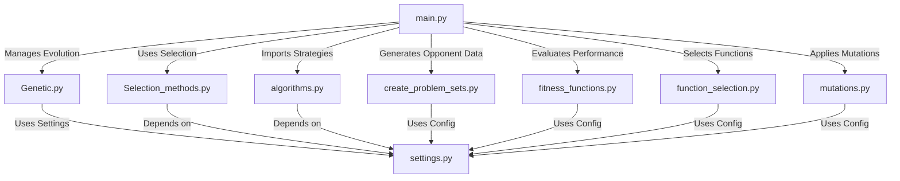

# CoEvolution-GA

## Project Overview

This project explores the application of co-evolutionary genetic algorithms to the game of Rock-Paper-Scissors (RPS). By evolving both player strategies and opponent strategies simultaneously, the goal is to develop robust decision-making agents capable of adapting to diverse and dynamic adversaries.

## Objectives

- **Co-Evolutionary Framework**: Implement a genetic algorithm that evolves player and opponent strategies in tandem, fostering mutual adaptation and complexity.
- **Strategy Optimization**: Enhance the performance of RPS strategies by minimizing predictability and maximizing win rates against a variety of opponents.
- **Performance Evaluation**: Assess the effectiveness of evolved strategies based on their ability to win against predefined opponent types.

## Repository Structure

```
CoEvolution-GA/
│-- main.py                 # Main script coordinating the evolutionary process
│-- Genetic.py              # Genetic algorithm core functionalities
│-- Selection_methods.py    # Various selection strategies (e.g., tournament, roulette)
│-- algorithms.py           # Contains different RPS strategy implementations
│-- create_problem_sets.py  # Generates and manages opponent strategy sets
│-- fitness_functions.py    # Defines evaluation functions for player/opponent strategies
│-- function_selection.py   # Manages the selection of functions used during evolution
│-- mutations.py            # Implements mutation strategies for diversity
│-- settings.py             # Configuration file for evolutionary parameters
│-- setup.py                # Script for setting up the project environment
│-- requirements.txt        # Dependencies required to run the project
│-- outputs/                # Stores logs, results, and performance metrics
│   ├── logs/               # Tracks execution history
│   ├── results/            # Stores computed performance metrics
│   ├── 100_PopSize_50_iter_30_rounds/
│       ├── Results_100_PopSize_50_iter_30_rounds.txt  # Detailed evolution performance
│-- img.png                 # Visual representation of the co-evolution process
```

## Dependency Map



## Implemented Strategies

The project incorporates several key strategies for playing RPS:

- **Our Agent's Strategy** (Evolved through co-evolutionary GA)
- **Anti Flat Player**
- **Copy Player**
- **Freq Player**
- **Flat Player**
- **Foxtrot Player**
- **Bruijn 81 Player**
- **Pi Player**
- **226 Player**
- **Random Player**
- **Rotating Player**
- **Switching Player**
- **Switch a Lot Player**
- **Greenberg Player**

## How the Algorithm Works

1. **Initialization**: Generates initial populations of player and opponent strategies, encoded as sequences representing decision-making rules.
2. **Evaluation**: Each player strategy competes against a subset of opponent strategies, measuring win rates and adaptability.
3. **Selection**: Chooses the best-performing strategies for reproduction.
4. **Crossover & Mutation**:
   - **Crossover**: Combines parts of two parent strategies to produce offspring with mixed characteristics.
   - **Mutation**: Introduces random changes to explore new behaviors and prevent stagnation.
5. **Replacement & Iteration**: The weakest strategies are replaced, and the process repeats for multiple generations.
6. **Termination**: The process stops when strategies reach a desired level of performance or after a predefined number of generations.

## Results and Performance Analysis

The evolution results are recorded in `outputs/100_PopSize_50_iter_30_rounds/Results_100_PopSize_50_iter_30_rounds.txt`, containing:

- **Win Ratios**: The percentage of wins for evolved strategies against predefined opponent types.
- **Opponent Strategies**: A variety of predefined opponents for robust testing.
- **Adaptation Metrics**: Measures how well the strategy adapts over multiple iterations.

Example result snippet:
```
Opponent: Anti Flat Player - Win Ratio: 72%
Opponent: Copy Player - Win Ratio: 65%
Opponent: Freq Player - Win Ratio: 58%
...
```

These results help analyze the effectiveness of the evolutionary process and suggest areas for further optimization.

## Running the Script

### Installation

1. **Clone the Repository**:
   ```bash
   git clone https://github.com/AbednAboH/CoEvolution-GA.git
   cd CoEvolution-GA
   ```

2. **Install Dependencies**:
   ```bash
   pip install -r requirements.txt
   ```

### Running the Evolutionary Process

Execute the script from the command line:

```bash
python main.py --generations 100 --population_size 50
```

### Command Line Parameters

- `--generations`: Number of generations for the evolution process.
- `--population_size`: Size of the population for player and opponent strategies.

Example:
```bash
python main.py --generations 200 --population_size 100
```

## Example Outputs

The `outputs/` directory contains logs and visualizations of the co-evolutionary process. Below is an example of a visualization showing the adaptation of strategies over generations:


This image illustrates how player and opponent strategies co-evolve, highlighting the effectiveness of the approach.

## Conclusion

This project successfully implements a co-evolutionary genetic algorithm for Rock-Paper-Scissors strategy development. By evolving both players and opponents simultaneously, the model creates robust, adaptive strategies. Future improvements could focus on refining fitness functions, expanding strategy diversity, and optimizing computational efficiency.

---

Feel free to use this `README.md` for your repository. Let me know if you need any modifications or additional details!
